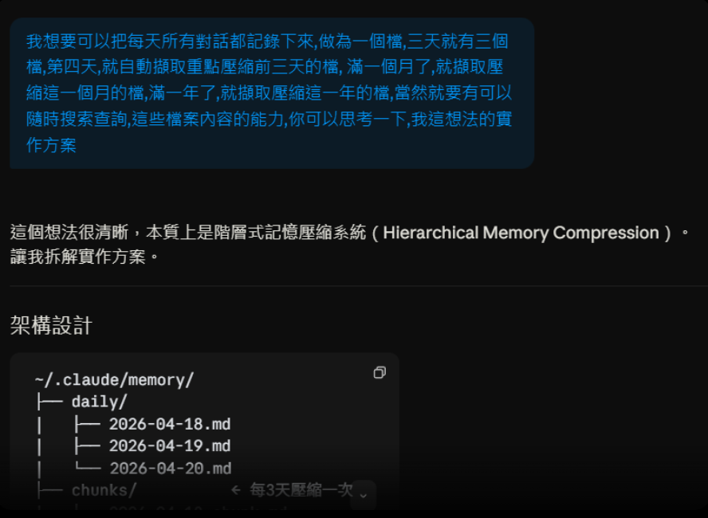

# HMC-Memory

> 🛸 **本專案由 [Claude Code](https://claude.ai/claude-code)（Sonnet 4.6）全程全權設計開發——從架構規劃到程式實作，從零到完成，一手包辦。**
> [boboidvtw](https://github.com/boboidvtw) 只有出點子和想法。

## 起源

這一切從這個想法開始：



**AI Agent 階層式記憶壓縮系統**

> 自動記錄每一次 AI 對話，並將每日記錄壓縮成週摘要、月摘要與年度回顧 — 全部可搜尋、全部在本地、除了 Node.js 和你的 LLM 之外零依賴。

[](LICENSE)
[](https://nodejs.org)
[](package.json)
[](https://modelcontextprotocol.io)

[English](./README.md) | 繁體中文

---

## 這是什麼？

大多數 AI 助理在對話結束後就忘記一切。HMC-Memory 透過自動將每次對話記錄到本地 Markdown 檔案來解決這個問題，並隨時間進行壓縮——就像一本會自動整理自己的日記。

**運作原理：**

```
每回合結束（Stop hook — turn-recorder.js）
       ↓
  User + Assistant 逐字對話即時寫入每日檔案
       ↓
每次 session 結束（SessionEnd hook — hook.js）
       ↓
  完整 transcript 備份寫入 + 觸發壓縮排程
       ↓  每 3 天
  3日摘要         (~/.hmc/chunks/2026-04-18_to_2026-04-20.md)
       ↓  每月 1 日
  月度摘要        (~/.hmc/monthly/2026-04.md)
       ↓  每年 1 月 1 日
  年度回顧        (~/.hmc/yearly/2026.md)
```

所有壓縮都由你的本地 LLM（LM Studio、Ollama 等）完成——資料永遠不會離開你的機器。

---

## 核心特性

- **逐字記錄** — Stop hook 在每回合結束後即時記錄完整的 user/assistant 對話原文
- **自動記錄** — 掛接 Claude Code 的 session 生命週期，靜默在背景執行
- **階層式壓縮** — 每日 → 3日chunk → 月度 → 年度，每一層由 AI 摘要
- **跨層搜尋** — 關鍵字同時搜尋所有層級
- **MCP Server** — 暴露 5 個工具，讓任何支援 MCP 的 AI 平台直接讀寫記憶
- **Generic Webhook** — 簡單的 HTTP server，讓非 MCP 平台也能傳入對話資料
- **零 npm 依賴** — 只使用 Node.js 18+ 內建模組，無需 `npm install`
- **本地優先** — 所有資料以純 Markdown 格式存於 `~/.hmc/`，可離線使用
- **多平台 LLM** — LM Studio（預設）、Ollama、Claude API、OpenAI API — 一個環境變數切換

---

## 系統需求

| 需求 | 說明 |
|------|------|
| **Node.js 18+** | Claude Code 已內建，無需另外安裝 |
| **LM Studio**（或 Ollama） | 提供壓縮摘要的 AI 模型 |
| 其他 | **完全沒有** |

無需 `npm install`、無需 Python、無需資料庫、無需 Docker。只要 Node.js 和你的 LLM 即可。

---

## 快速開始

### 1. Clone 專案

```bash
git clone https://github.com/boboidvtw/hmc-memory.git
cd hmc-memory
```

### 2. 設定你的 LLM

將 `.env.example` 複製到 `~/.hmc/.env` 並設定後端：

```bash
# LM Studio 最小設定（預設）
HMC_LLM_BACKEND=lmstudio
HMC_LMSTUDIO_URL=http://127.0.0.1:1234/v1
```

在觸發壓縮之前，確保 LM Studio 正在運行且已載入模型。

### 3. 安裝（自動偵測平台）

```bash
node bin/cli.js install
```

這會自動：
- 建立 `~/.hmc/` 目錄結構
- 注入 **Stop hook**（`turn-recorder.js`）— 每回合即時記錄逐字對話
- 注入 **SessionEnd hook**（`hook.js`）— session 結束時寫入完整 transcript 並觸發壓縮
- 註冊 MCP server，讓 Claude 可以直接呼叫記憶工具

### 4. 驗證安裝

```bash
node bin/cli.js status
```

```
📊 HMC-Memory 狀態

記憶目錄: ~/.hmc

今日記錄: 0 筆，0 KB

各層統計:
  daily    0 個檔案  最新: 無  總大小: 0 KB
  chunks   0 個檔案  最新: 無  總大小: 0 KB
  monthly  0 個檔案  最新: 無  總大小: 0 KB
  yearly   0 個檔案  最新: 無  總大小: 0 KB
```

從現在起，每次 Claude Code session 結束都會自動寫入今日記錄，並在需要時觸發壓縮。

---

## 儲存結構

所有記憶存放於 `~/.hmc/`：

```
~/.hmc/
├── .env                              ← 你的 LLM 設定
├── config.json                       ← 最後壓縮時間戳記
├── index.json                        ← 搜尋索引（自動維護）
│
├── daily/
│   ├── 2026-04-18.md                 ← 每天一個檔案
│   ├── 2026-04-19.md
│   └── 2026-04-20.md
│
├── chunks/
│   └── 2026-04-18_to_2026-04-20.md  ← 每 3 天由 AI 壓縮產生
│
├── monthly/
│   └── 2026-04.md                    ← 每月 1 日自動產生
│
└── yearly/
    └── 2026.md                       ← 每年 1 月 1 日自動產生
```

每個檔案都是純 Markdown — 可在任何編輯器中閱讀，可用任何工具搜尋。

---

## 記錄機制：記了什麼？

HMC-Memory 使用**兩個 hook 並行運作**：

| Hook | 觸發時機 | 寫入內容 |
|------|---------|---------|
| **Stop**（`turn-recorder.js`） | 每次 assistant 回應後 | 最新一組 user 訊息 + assistant 回應，逐字保留 |
| **SessionEnd**（`hook.js`） | Session 結束時 | 完整 transcript（所有回合）作為保底；觸發壓縮排程 |

Stop hook 是主要記錄器，每回合即時寫入。SessionEnd hook 補漏（例如 session 意外中斷時），同時負責觸發壓縮排程。

---

## 壓縮時程

壓縮在每次 Claude Code session 結束時自動觸發：

| 觸發條件 | 輸入 | 輸出 |
|---------|------|------|
| 每 3 天（可設定） | 3個每日檔案 | 1個chunk摘要 |
| 每月 1 日 | 上個月所有每日檔案 | 1個月度摘要 |
| 每年 1 月 1 日 | 上年所有月度檔案 | 1個年度回顧 |

每一層約為其輸入的 20% 大小。一年後，數千個每日記錄變成一個簡潔的檔案。

**原始檔案永遠不會被刪除。** 壓縮只新增摘要檔案。

---

## CLI 指令參考

```bash
node bin/cli.js <指令> [選項]
```

| 指令 | 說明 |
|------|------|
| `install` | 建立目錄、注入 hooks 與 MCP 設定 |
| `install --platform claude-code` | 強制使用 Claude Code adapter |
| `install --platform generic` | 強制使用 HTTP webhook adapter |
| `install --no-mcp` | 安裝但不設定 MCP server |
| `uninstall` | 移除 hooks 與 MCP 設定（資料保留） |
| `search <關鍵字>` | 跨所有記憶層搜尋 |
| `search <關鍵字> --layer daily` | 只搜尋每日記錄 |
| `search <關鍵字> --limit 5` | 限制回傳筆數 |
| `compress chunk` | 手動觸發 3日壓縮 |
| `compress month` | 手動觸發月度壓縮 |
| `compress year` | 手動觸發年度壓縮 |
| `status` | 顯示各層檔案數量與大小 |
| `today` | 印出今日記憶檔案 |
| `reindex` | 重建搜尋索引 |

---

## MCP 工具

安裝後，HMC-Memory 會註冊一個 MCP server。任何支援 MCP 的 AI 平台都可以直接呼叫以下工具：

| 工具 | 功能 |
|------|------|
| `memory_record` | 將筆記或對話寫入今日檔案 |
| `memory_search` | 以關鍵字搜尋所有層級 |
| `memory_today` | 讀取今日完整記憶檔案 |
| `memory_compress` | 手動觸發壓縮 |
| `memory_status` | 取得各層檔案數量與大小 |

使用情境範例：

> 「上週我們對 MAMGA 架構做了什麼決定？」
> → Claude 呼叫 `memory_search`，查詢「MAMGA 架構」
> → 從每日和 chunk 檔案中回傳相關段落

---

## Generic Webhook（非 MCP 平台）

對於不支援 MCP 的平台，啟動 webhook server：

```bash
node src/adapters/generic/webhook.js
# 監聽於 http://localhost:4821
```

接著從任何平台以 POST 傳送對話資料：

```bash
# 記錄一筆訊息
curl -X POST http://localhost:4821/record \
  -H 'Content-Type: application/json' \
  -d '{"text": "今天完成了 API 設計定案。", "platform": "my-ai", "role": "assistant"}'

# 記錄 session 摘要
curl -X POST http://localhost:4821/session \
  -d '{"summary": "完成 API 設計審查。", "platform": "my-ai"}'

# 搜尋記憶
curl "http://localhost:4821/search?q=API設計&limit=5"

# 查看狀態
curl http://localhost:4821/status

# 手動觸發壓縮
curl -X POST http://localhost:4821/compress \
  -d '{"level": "chunk"}'
```

---

## LLM 後端設定

在 `~/.hmc/.env` 中設定 `HMC_LLM_BACKEND`：

| 值 | 平台 | 說明 |
|----|------|------|
| `lmstudio` | LM Studio | **預設**，本地運行於 port 1234 |
| `ollama` | Ollama | 本地運行於 port 11434 |
| `claude` | Claude API | 需要 `ANTHROPIC_API_KEY` |
| `openai` | OpenAI API | 需要 `OPENAI_API_KEY` |
| `custom` | 任何 OpenAI 相容 API | 設定 `HMC_CUSTOM_URL` 和 `HMC_CUSTOM_MODEL` |

LLM **只在壓縮時被呼叫**。記錄與搜尋是純檔案 I/O — 即使 LLM 離線也能正常運作。

### .env 設定範例

**LM Studio（本地使用推薦）：**
```env
HMC_LLM_BACKEND=lmstudio
HMC_LMSTUDIO_URL=http://127.0.0.1:1234/v1
HMC_LMSTUDIO_MODEL=你的模型名稱
```

**Ollama：**
```env
HMC_LLM_BACKEND=ollama
HMC_OLLAMA_URL=http://127.0.0.1:11434/v1
HMC_OLLAMA_MODEL=llama3
```

**自訂本地端點：**
```env
HMC_LLM_BACKEND=custom
HMC_CUSTOM_URL=http://127.0.0.1:8080/v1
HMC_CUSTOM_MODEL=my-model
```

---

## 各層壓縮策略

HMC-Memory 針對不同壓縮層使用不同的 prompt，以提取適當層次的細節：

**Chunk（3日）** — 戰術層：做了什麼、做了哪些決定、具體的檔案名稱和指令。約為原文的 25%。

**Monthly（月度）** — 策略層：哪些專案有進展、確定了哪些架構選擇、還有什麼進行中。約為原文的 15%。

**Yearly（年度）** — 歷史層：重大成就、技術轉變、長期專案的演化軌跡。約為月度總量的 10%。

所有 prompt 都在 `templates/` 目錄中，可自行修改。

---

## 平台支援

| 平台 | 自動記錄 | MCP 工具 | 說明 |
|------|---------|---------|------|
| **Claude Code** | ✅ 每回合逐字記錄（Stop hook）+ 完整 transcript（SessionEnd hook） | ✅ | 主要支援平台 |
| **任何 MCP 平台** | 手動 / webhook | ✅ | 已包含 MCP server |
| **任何 HTTP 平台** | ✅ 透過 webhook POST | — | 使用 generic adapter |
| **CLI / 腳本** | ✅ `node bin/cli.js` | — | 直接使用 |

---

## 每日檔案格式

每個每日檔案遵循以下結構：

```markdown
# 2026-04-20

> 自動記錄 by HMC-Memory

---

## 09:32 `[claude-code]`
**👤 User**

為什麼 HMC-Memory 要用 MCP-first 架構？

---

## 09:32 `[claude-code]`
**🤖 Assistant**

因為 MCP（Model Context Protocol）是各大 AI 平台通用的工具呼叫協議——
一套核心程式碼，支援所有平台。

---

## 10:15 📋 Session Summary `[claude-code]`

完成 HMC-Memory Phase 1-4。storage、recorder、壓縮引擎、
搜尋、MCP server 和 CLI 全部正常運作。

---
```

純 Markdown。可在 Obsidian、VS Code、GitHub、任何文字編輯器中使用。

---

## 相關專案

### MAMGA-Local
**[https://github.com/boboidvtw/MAMGA-Local](https://github.com/boboidvtw/MAMGA-Local)**

Multi-Graph based Agentic Memory for Local AI — 以四圖結構（時間圖、語意圖、因果圖、實體圖）為基礎的本地 LLM 記憶架構。

HMC-Memory 的 **Roadmap** 中包含 MAMGA-Local 整合（Phase 7），屆時搜尋功能將從純關鍵字升級為**向量語意搜尋**與**多跳推理查詢**：

```
目前:  HMC-Memory → 關鍵字搜尋 Markdown 檔案
未來:  HMC-Memory → MAMGA-Local → 語意搜尋 + 圖推理
```

如果你需要更強的語意搜尋能力，可以先單獨部署 MAMGA-Local：

```bash
git clone https://github.com/boboidvtw/MAMGA-Local.git
cd MAMGA-Local
pip install -r requirements.txt
python main.py build --input path/to/data.json
```

---

## 接續開發

本專案使用 `PLAN.md` 任務清單。如果需要在 context 重置後繼續開發，告訴你的 AI 助理：

```
請讀 C:\claudecode\hmc-memory\PLAN.md，然後繼續 HMC-Memory 專案的開發。
找到第一個未完成的 Task（[ ]），從那裡開始。
```

---

## 開發路線圖

- [x] 核心記錄（每日檔案）
- [x] 階層式壓縮（chunk / 月度 / 年度）
- [x] 跨層關鍵字搜尋
- [x] MCP server（5 個工具）
- [x] Claude Code adapter（SessionEnd hook + Stop hook 逐字記錄）
- [x] Generic HTTP webhook adapter
- [x] 零 npm 依賴
- [x] 多後端 LLM 支援
- [ ] MAMGA-Local 整合（語意搜尋）— [MAMGA-Local](https://github.com/boboidvtw/MAMGA-Local)
- [ ] 記憶層瀏覽 Web UI
- [ ] npm 發布（`npx @boboidvtw/hmc-memory install`）

---

## 授權

MIT — 可自由使用、修改與散佈。
